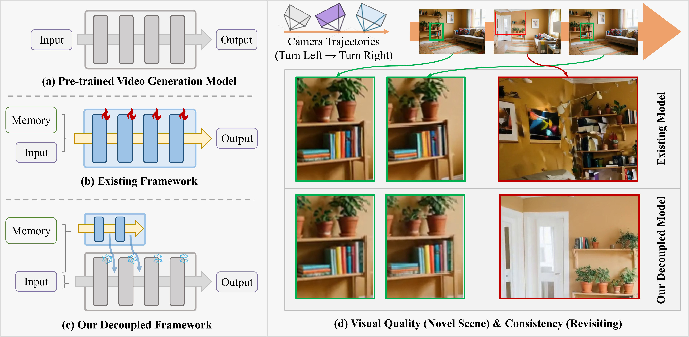

<p align="center">
  <h2 align="center"> Memorize When Needed:  <br>  Decoupled Memory Control for Spatially Consistent Long-Horizon Video Generation </h2>
</p>

<p align="center">
  <a href="https://scholar.google.com/citations?hl=zh-CN&user=j1ypDt8AAAAJ">Yanjun Guo</a> <sup>1,2,*</sup>
  ·
  <a href="https://scholar.google.com/citations?user=UX26wSMAAAAJ&hl=en">Zhengqiang Zhang</a> <sup>1,2,*</sup>
  ·
  <a href="https://scholar.google.com/citations?user=zAAYwRYAAAAJ&hl=en">Pengfei Wang</a> <sup>1,*</sup>
  ·
  <a href="https://scholar.google.com/citations?user=R9PlnKgAAAAJ&hl=zh-CN">Xinyue Liang</a> <sup>1</sup>
  ·
  <a href="https://scholar.google.com/citations?user=F15mLDYAAAAJ&hl=en">Zhiyuan Ma</a> <sup>1</sup>
  ·
  <a href="https://scholar.google.com/citations?user=tAK5l1IAAAAJ&hl=en">Lei Zhang</a> <sup>1,2.†</sup>
</p>

<p align="center">
  <sup>1</sup>The Hong Kong Polytechnic University<br>
  <sup>2</sup>OPPO Research Institute
</p>

<h4 align="center">
  <a href="https://arxiv.org/abs/2604.18215" target="_blank">
    
  </a>
  <a href="https://github.com/iGuoYanjun/Memorize-When-Needed" target="_blank">
    
  </a>
  <a href="https://huggingface.co/Guoyanjun/MemorizeWhenNeed" target="_blank">
    
  </a>
  <a href="https://youtu.be/oBq52WvBxkg" target="_blank">
    
  </a>
</h4>

<p align="center">
  <a href="">
    
  </a>
</p>


<table align="center" width="900">
  <tr>
    <td>
      <p align="justify">
        We propose a decoupled framework for spatially consistent long-horizon video generation，which separates memory conditioning from generation. Our approach significantly reduces training costs while simultaneously enhancing spatial consistency and preserving the generative capacity for novel scene exploration.
      </p>
    </td>
  </tr>
</table>
<br>


## 📰 News
- **[2026.04]** We release our paper on [arXiv](https://arxiv.org/abs/2604.18215).
- **[2026.04]** We release model [Huggingface](https://huggingface.co/Guoyanjun/MemorizeWhenNeed) based on **Wan2.1**.
- **[2026.04]** We release the test data on [Huggingface](https://huggingface.co/Guoyanjun/MemorizeWhenNeed) used in our paper to make easier evaluation.

## 🎥 Visual Results

<div align="center">
  <h3>RealEstate10K and OOD Examples</h3>
  <p><em>The first two videos present results on RealEstate10K, while the remaining six videos show OOD examples.</em></p>
</div>

<table align="center" style="border: none; border-collapse: collapse;">
  <tr>
    <td align="center" style="border: none; padding: 8px;">
      <p><strong>RealEstate10K Example 1</strong></p>
      <video src="https://github.com/user-attachments/assets/f6051729-6a3a-4a78-813e-81f2a668eb7d" width="420" controls></video>
    </td>
    <td align="center" style="border: none; padding: 8px;">
      <p><strong>RealEstate10K Example 2</strong></p>
      <video src="https://github.com/user-attachments/assets/cda44ab0-99e4-4ac7-a40d-a85926e2f921" width="420" controls></video>
    </td>
  </tr>
  <tr>
    <td align="center" style="border: none; padding: 8px;">
      <p><strong>OOD Example 1</strong></p>
      <video src="https://github.com/user-attachments/assets/32e74a0b-b82c-472d-baed-b8ce0112f99f" width="420" controls></video>
    </td>
    <td align="center" style="border: none; padding: 8px;">
      <p><strong>OOD Example 2</strong></p>
      <video src="https://github.com/user-attachments/assets/ef9942cb-477e-439d-bab8-cfd8982f1dd3" width="420" controls></video>
    </td>
  </tr>
  <tr>
    <td align="center" style="border: none; padding: 8px;">
      <p><strong>OOD Example 3</strong></p>
      <video src="https://github.com/user-attachments/assets/9498c941-08c0-4c29-aeac-64ed0e4e6c4f" width="420" controls></video>
    </td>
    <td align="center" style="border: none; padding: 8px;">
      <p><strong>OOD Example 4</strong></p>
      <video src="https://github.com/user-attachments/assets/3c354740-8256-4d3a-9057-84b568628456" width="420" controls></video>
    </td>
  </tr>
  <tr>
    <td align="center" style="border: none; padding: 8px;">
      <p><strong>OOD Example 5</strong></p>
      <video src="https://github.com/user-attachments/assets/85c1377d-613a-4551-8724-c0e763a08645" width="420" controls></video>
    </td>
    <td align="center" style="border: none; padding: 8px;">
      <p><strong>OOD Example 6</strong></p>
      <video src="https://github.com/user-attachments/assets/fb07e86f-c9fb-40e3-b3c2-82e131ce7377" width="420" controls></video>
    </td>
  </tr>
</table>

<div align="center">

### 🌟 More Results and Method Comparisons

*Watch our [YouTube demo video](https://youtu.be/oBq52WvBxkg) for additional examples and side-by-side comparisons with other methods.*

</div>


## 📖 **Abstract**


<div style="text-align: justify">
Spatially consistent long-horizon video generation aims to maintain temporal and spatial consistency along predefined camera trajectories. Existing methods mostly entangle memory modeling with video generation, leading to inconsistent content during scene revisits and diminished generative capacity when exploring novel regions, even trained on extensive annotated data. To address these limitations, we propose a decoupled framework that separates memory conditioning from generation. Our approach significantly reduces training costs while simultaneously enhancing spatial consistency and preserving the generative capacity for novel scene exploration. Specifically, we employ a lightweight, independent memory branch to learn precise spatial consistency from historical observation.
We first introduce a hybrid memory representation to capture complementary temporal and spatial cues from generated frames, then leverage a per-frame cross-attention mechanism to ensure each frame is conditioned exclusively on the most spatially relevant historical information, which is injected into the generative model to ensure spatial consistency.
When generating new scenes, a camera-aware gating mechanism is proposed to mediate the interaction between memory and generation modules, enabling memory conditioning only when meaningful historical references exist.  
Compared with the existing method, our method is highly data-efficient, yet the experiments demonstrate that our approach achieves state-of-the-art performance in terms of both visual quality and spatial consistency. 
</div>


## 🚀 Get Started

### Installation

We test the released code with Python 3.11, CUDA 12.4, and PyTorch 2.6.0.

```bash
git clone https://github.com/iGuoYanjun/Memorize-When-Needed.git
cd Memorize-When-Needed

conda create -n memorize-when-needed python=3.11 -y
conda activate memorize-when-needed

pip install -r requirements.txt
```

### Required Checkpoints

We recommend downloading all checkpoints under `./checkpoints`.

```bash
mkdir -p ./checkpoints
```

First, download the base Wan model from Hugging Face:

```bash
huggingface-cli download Wan-AI/Wan2.1-I2V-14B-480P \
  --local-dir ./checkpoints/Wan2.1-I2V-14B-480P \
  --local-dir-use-symlinks False
```

Then, download our two released checkpoints from [Hugging Face](https://huggingface.co/Guoyanjun/MemorizeWhenNeed). 

```bash
huggingface-cli download Guoyanjun/MemorizeWhenNeed \
  --include "camera_controlnet/**" \
  --local-dir ./checkpoints \
  --local-dir-use-symlinks False

huggingface-cli download Guoyanjun/MemorizeWhenNeed \
  --include "history_controlnet/**" \
  --local-dir ./checkpoints \
  --local-dir-use-symlinks False
```

After downloading, your local directory can look like:

```text
checkpoints/
├── Wan2.1-I2V-14B-480P/
│   └── ...
├── camera_controlnet/
│   ├── config.json
│   ├── diffusion_pytorch_model.safetensors
└── history_controlnet/
    ├── config.json
    └── diffusion_pytorch_model.safetensors
```

### Code Usage

We provide `infer.sh` as a simple launcher for testing the released assets. By default, it reads `./assets/prompt.json`, uses the checkpoints under `./checkpoints`, and writes results to `./results`.

```bash
bash infer.sh
```

You can also override the default paths and inference settings from the command line:

```bash
PRETRAINED_MODEL_NAME_OR_PATH=./checkpoints/Wan2.1-I2V-14B-480P \
CONFIG_PATH=./config/wan2.1/wan_civitai.yaml \
METADATA_PATH=./assets/prompt.json \
CONTROLNET_CKPT_DIR=./checkpoints/camera_controlnet \
HISTORY_CONTROLNET_CKPT=./checkpoints/history_controlnet \
OUTPUT_DIR=./results \
GPU_ID=0 \
NUM_INFERENCE_STEPS=40 \
bash infer.sh
```

Each sample in `assets/prompt.json` should provide the input image, text prompt, and camera pose file:

The text prompt has a clear impact on generation quality, so we recommend using descriptions that follow the prompting style of Wan2.1.

```json
{
  "img": "img/scene_01_modern_interior.png",
  "prompt": "A text prompt for video generation.",
  "pose": "pose/cam0.txt"
}
```

The generated videos are saved under `OUTPUT_DIR`.


## 🔗 BibTeX
```
@article{guo2026memorize,
  title={Memorize When Needed: Decoupled Memory Control for Spatially Consistent Long-Horizon Video Generation},
  author={Guo, Yanjun and Zhang, Zhengqiang and Wang, Pengfei and Liang, Xinyue and Ma, Zhiyuan and Zhang, Lei},
  journal={arXiv preprint arXiv:2604.18215},
  year={2026}
}
```


## Contact
Please send emails to yanjunn.guo@connect.polyu.hk if there is any question.

## Acknowledgements
We would like to thank the contributors to [Wan2.1](https://github.com/Wan-Video/Wan2.1), [VideoX-Fun](https://github.com/aigc-apps/VideoX-Fun), [AC3D](https://github.com/snap-research/ac3d), [WorldMem](https://github.com/xizaoqu/WorldMem), and [CogVideoX](https://github.com/zai-org/CogVideo) for their open-source code and inspiring research, which greatly informed the development of our codebase.